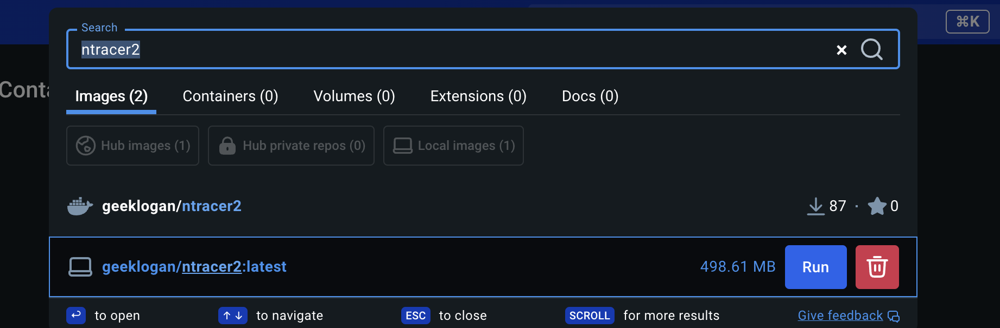
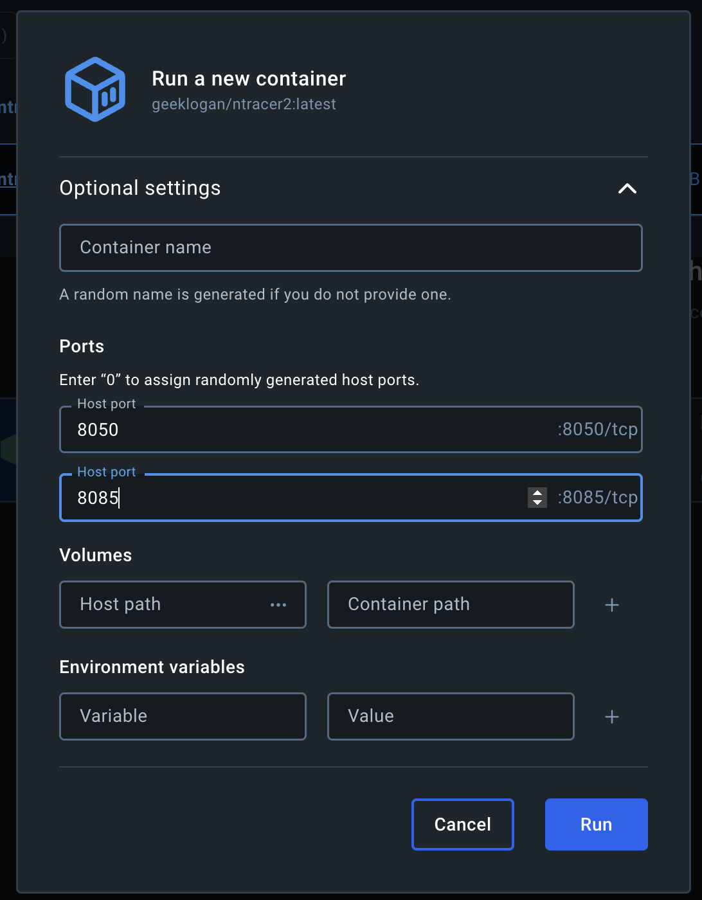
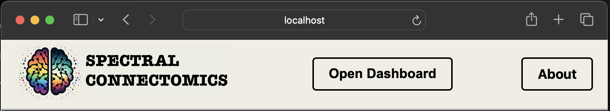
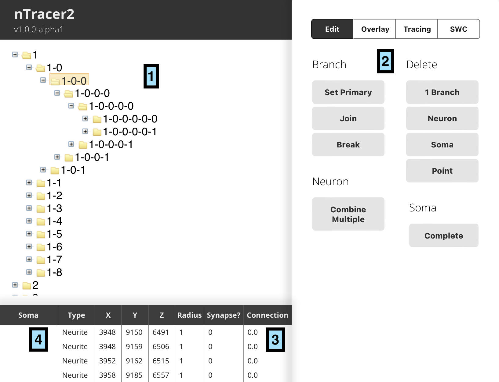

# nTracer2 Usage

An interactive tool for reconstructing and analyzing complex neural networks from multi-color fluorescent images.

## Installing and starting nTracer2

1. Before beginning, ensure that your compute has sufficient RAM and processing power to support nTracer2. We suggest a minimum of 8GB of RAM for a Mac and 16GB for Windows, however your experience may vary. Also ensure that you have a high speed internet connection, as low quality wi-fi is the most common cause of complaint

    - You can use tools like [fast.com](fast.com) to test your internet speed. Speeds under ~50mbps tend to lead to slow tracing experiences.

2. Next, ensure that you have an up-to-date docker or Docker-desktop installation on the compute that will be used for tracing. We package nTracer2 using Docker to allow it to be reproducibily run on many different machines and provide images for both ARM and AMD64 architectures. 32 bit architectures are not supported.

3. To run nTracer2, there is both a GUI (user interface) and command line option for starting the Docker image:

    - GUI Option (Docker Desktop):
        1. If you are using Docker Desktop, use the search box at the top of the window to search `nTracer2`.

        2. Select the "Run" button next to `geeklogan/ntracer2`, which is the Cai-lab prebuilt nTracer2 image: 

        3. When prompted, select ports to be used by the server, we recommend using the default values. It is also possible to provide a container name for the nTracer2 image: 

        4. Run the image and allow the image to start.

    - Command Line Option:
        - Navigate to the nTracer2 folder on your computer and execute: 
            ```
            docker compose build
            docker compose up
            ```

4. To specifying a different dataset or change the port used by the server:

    - To change the URL for the image source and the dataset ID, we specify the build args:
        ```
        docker build --build-arg cdn_url=https://sonic2.cai-lab.org/data/ --build-arg dataset_id=packed2 -t ntracer2 .
        ```

    - Additional args to customize exposed port and public address (if hosting on a server):
        ```
        docker build --build-arg server_port=8080 --build-arg neuroglancer_port=8050  --build-arg public_url=https://ntracer.cai-lab.org -t ntracer2 .
        ```

5. Open a browser (Chrome or Chromium are recommended) and navigate to [localhost:8085/dashboard]( localhost:8085/dashboard) where `8085` can be replaced with an alternate port if chosen above.

6. The resulting window should show the tracing neuroglancer window with a custom border: 

7. Click "Open Dashboard" to open the nTracer2 tracing interface in another browser window. The application should now be ready to operate.


## Control Panel Layout

Familiarize yourself with different menu options and command buttons in the control panel. Most of the menus will display a short description as a rollover text. Some of the basic menus are briefly described below.



1.	Trace Diagram
The overall architecture of the tracing data is displayed as a tree diagram

2.	Toolbox (Tracing/Edit/Overlay)
Change the settings in each window as you perform your tracings and data analysis. We will go over each menu as part of the following tutorials: 
Tracing (chapter 3)
Editing and overlay (chapter 4)

3.	Traced Points Databox
This window displays the vector information for the selected trace as well as the synapse and connectivity data corresponding to each point

4.	Soma Databox
Traces of somas are organized and displayed by z-stack (1:100 means soma tracing of neuron #1 in image slice 100)


## Tracing Tutorial

### Soma tracing